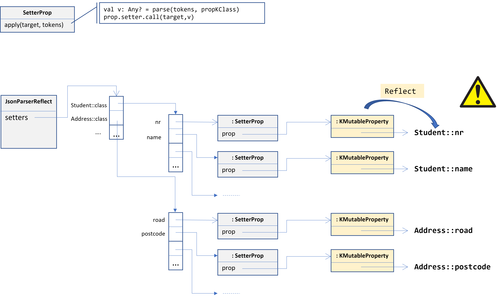
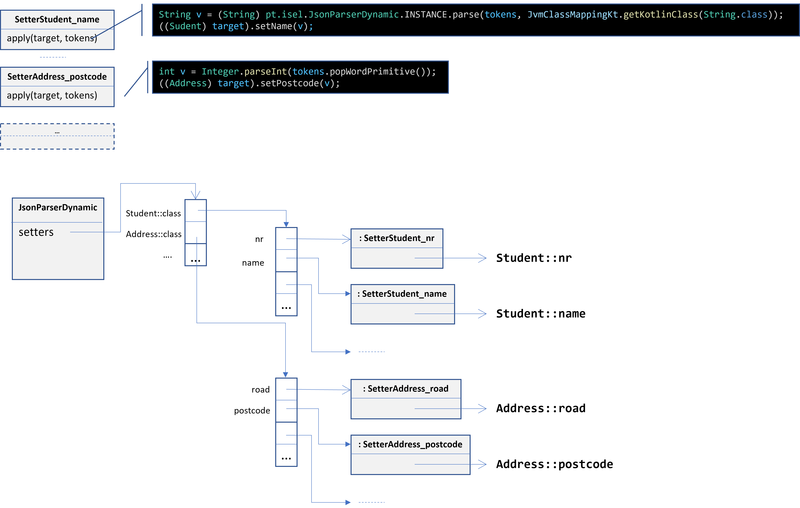

# Enunciado do Trabalho 2 - `jsonaif` via dynamic code generation

**Data limite de entrega: 16 de Maio**

No seguimento do Trabalho 1 desenvolvido na biblioteca `jsonaif` pretende-se
desenvolver uma nova classe `JsonParserDynamic` com o mesmo comportamento de
`JsonParserReflect`, mas que **NÃO usa reflexão na atribuição de valores às
propriedades**. Note, que **continuará a ser usada reflexão na leitura** da
_metadata_, deixando apenas de ser usada reflexão em operações como
`<property>.setter.call(…)`.  A atribuição de valores a propriedades passa a ser
realizada directamente com base em código gerado em tempo de execução
através da API de ..... 

**NOTA** Igonore o caso de propriedades imutáveis iniciadas pelo construtor.

O diagrama da [figura 1](#figura-1---diagrama-de-jsonparserdynamic) apresenta um
exemplo do objecto `JsonParserReflect` do Trabalho 1, onde cada instância de
`SetterProp` está associada a uma instância de `KMutableProperty` que actua
sobre uma determinada propriedade.
A classe `SetterProp` implementa o código de afectação de uma propriedade via
reflexão comum a todas as propriedades.
A amarelo é evidenciado o que se pretende eliminar com a implementação do
Trabalho 2.

##### **Figura 1 - Diagrama de `JsonParserReflect`**
***

O diagrama da [figura 2](#figura-2---diagrama-de-jsonparserdynamic) apresenta um
exemplo do objecto `JsonParserDynamic` onde cada propriedade tem uma
implementação de `Setter` específica (e.g. `SetterStudent_name`,
`SetterAddress_postcode`), evitando o uso de reflexão na afectação de uma
propriedade.
Note ainda que para propriedades de tipo primitivo (e.g. `postcode`) a implementação
de `Setter` evita a chamada ao `parse()` da base para que incorrer nos custos das
operações de _boxing_ e _unboxing_.

##### **Figura 2 - Diagrama de `JsonParserDynamic`**
***

`JsonParserDynamic` deve gerar em tempo de execução implementações das classes
que implementam a interface `Setter` para cada propriedade.

Além de testes unitários que validem o correcto funcionamento de
`JsonParserDynamic` complete a aplicação consola do projecto **jsonaif-bench**,
para comparar o desempenho do método `parse()` entre as classes `JsonParserReflect` e
`JsonParserDynamic`.

Para as medições de desempenho **use a abordagem apresentada nas aulas**
(**atenção que testes de desempenho não são testes unitários**). Registe e
comente os desempenhos obtidos entre as duas abordagens. 
